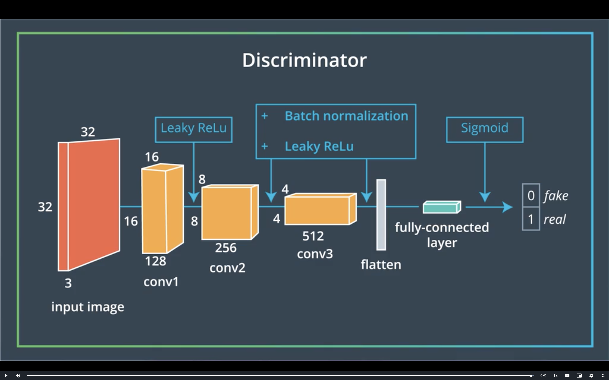
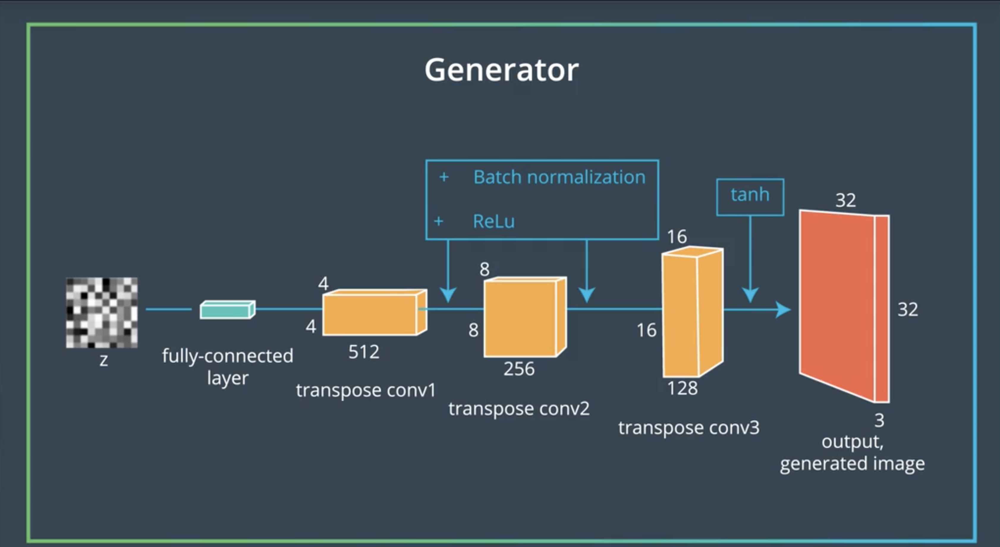

# Generative Adversarial Networks

# Applications of GANs

---

## StackGan Model

This model takes in a description of a bird and generates a high-resolution image of a bird matching that description. These are images that have not been seen before which means the gan is not searching for an image in a set of images but generates a new image.

## IGAN

These Gan helps artist when a doodle is drawn using a mouse these GANs translate them to images

## Pix2Pix

The GANs take input of an image in one domain and convert them to images in other domains for examples blueprints of building can be changed to images of buildings or drawings of cat can be turned into images of cats.

## Cartoon GANs

These GANs generate cartoon face given a normal face, these GANs were trained on faces of people and cartoon faces but they were not told what image is mapped to what.

## Cycle GANS

These GANs also uses unsupervised learning they can do things like take in a video of a horse and convert it to a video of a zebra , since they are using unsupervised learning they not only convert the horse object but also some parts of the background since they are using unsupervised learning.

## Simulated Training

GANs can take in input of 3d or 2d models and create realistic datasets which can be used as training dataset for image recognition tools.

# How GAN's Work

As we know RNNs can be used for generating text data word by word at a time similarly image can also be generate by fully visible belief networks (what it was called in the 90's) by generating pixel by pixel at a time these are called Autoregressive models (renamed when they were rediscovered later). 

But if we need to generate an entire image as output we use GANs, They consist of two different neural networks called as generators and discriminator.

## Generator

---

The generator is a neural network which takes in a random noise and runs it to a neural network to generate an image this image is *realistic.* The choice of the random noice determine how *realistic* the image is. The generator learns to create these data looking at the data provided.

Unlike a supervised learning model Generative models doesn't have labels to tell what to learn from but they are asked to make more images that come from the same probability distribution.

How do we do this ?

Most generative models do this by adjusting the parameters of the generator but this is difficult to compute this. Most models do this by using some kind of approximations GANs uses some kind of approximations called as Discriminator.

## Discriminator

---

The discriminator is a normal classifier neural net which predicts if the image generated by the generator is real or fake, if it is real the generator will give a value close to one if not otherwise.

Overtime generator tries to make images which have probability close to one and discriminator gets better and better at determining which images are not real.

# Games and Equilibria

# Game Theory

For an generative adversarial network the Generator and the Discriminator are in competition with each other. In order to understand this competition we use Game theory.

Game theory defines co-operation and conflict between rational agents in any situation where each agents can choose from a set of actions and every action has a well defined payoff for each player.

# Rock-Paper-Scissors

Each player can choose to play Rock, Paper or Scissors this defines a set of actions.

Each player is also associated with a payoff

The winning player receives a payoff of +1

The loosing player receives a payoff of -1

and if both players chooses to play the same they both receive a payoff of 0

## The basic rule

rock smashes scissors, scissors cut paper and paper covers rock.

## The IDEA

Suppose that player one always plays scissors and player two always play rock this means player one always looses and player two always wins. Player one can improve the strategy by playing scissors more often. 

If the players are allowed to randomise there moves they will eventually go to equilibrium where neither player can improve there payoff by improving there strategy.

Lets consider that player two chooses rock,paper or scissors uniformly at random.

If player one increases his strategy by increasing the time he plays rock this would increase the chance of winning for player one but at the same time if player two plays scissors for the same amount of increased time then this would cancel out the wins of player one.

This gives basic understanding of Game theory and tells us that rational agents can learn to play completely at random.

## Applying this to GANs

If we can understand the equilibrium of the ROCK-PAPER-SCISSOR game we can apply this to the GAN game we can use this as a defining character for training GANs.

Most ML models are based on Optimisation

we write down the cost function of the algorithm, we visualise this and try to minimise this losses.

The goal of the algorithm is to reach a local minima or a minima but this does not usually happen due to some arithmetic limits.

For GANs the two different players the Generator and the Discriminator both have there own costs.

The generator wants to minimise the value function and the discriminator wants to maximise the value functions.

# Tips for training GANs

- Choose good architecture

If we are planning on making a GAN which is used to generate hand-written digits we can use a fully connected architecture.

---

## Fully connected layers

one of the best design choices when it comes to a fully connected network is that most of the layers include matrix multiplication.

The generator and discriminator have one hidden layer to ensure that both the models can have a universal approximate property and can represent any probability distribution.

---

## Leaky Relu

They are popular for GANs as they are very use-full for making gradients flow through the entire model. These can be used in any models but they are very useful in GANs since the only way for the generator to learn is by the gradient flowing though the discriminator.

---

## Hyperbolic Tangent

The output of the generator is prescribed to be a hyperbolic tangent so that the values are scaled between -1 and +1

---

## Sigmoid

for the output of the discriminator is prescribed to be sigmoid since we need a probability to be the output.

Unlike other machine learning models GANs need to neural networking working together to produce an output and hence we need two simultaneous optimisations.

---

## Two simultaneous Optimisations

we define two separate losses for the discriminator and other for the generator. 

then we use two optimisers simultaneously to decrease the losses for each.

Adam is the a popular choice for optimiser.

for the discriminator we need to make a classifier which gives 0 when the predicted value is fake and 1 when it is real.

Here we can use a simple cross entropy loss to calculate our loss.

One of the common mistakes made while calculating the loss is using the stable version of cross entropy loss which is calculated using the logits. Which takes the value calculated by the discriminator right before the sigmoid functions.

---

## Discriminator Loss

in order to avoid rounding error what we can do is to go a gan specific label normalisation by multiplying the labels with a very close value to 1 like 0.9

This would allow the discriminator to generalise better and avoid making extreme predictions while extrapolating.

## Generator Loss

For this we use the same stable cross entropy loss of the discriminator but with the labels flipped what this does is give us the advantage of increasing the log probability.

Negative D loss is commonly used for this.

What this does is the generator maximise the loss for the discriminator. This is good for visualisation but is not good in practice.

The gradient of Dloss is 0 when discriminator is winning because this would result in maximising the cross entropy.

---

# Scaling these GANs

So far we have been discussing based on fully connected network but in order to scale these GANs we need to consider using convolution and replace the fully connected networks.

In normal cases we use a convolutional neural network we take an image with three dimensions representing three colour channels of red blue and green then we move on to passing it through convolutional and pooling layers we end up with short and narrow feature maps.

but this is for a classifier for using in a generator we need to do the opposite.

We need to increase the size of the feature maps as we are passing though the CNN.

The DC project does this by using convolutional transpose ops with stride greater than one.

This means when we compute the convolution when we move the stride by one in input we move by two or more in the output kernel.

We end up my using batch normalisation, the dc gan ask us to apply batch normalisation to every layer except the output of the generator and input of discriminator.

---

# MNIST GANs
[Notebook MNIST](https://github.com/abhijitramesh/GAN-under-the-hood/blob/master/MNIST_GAN.ipynb)

Checkout my implementation on MNIST GAN where I teach the generator to make real images provided with at latent space vector and the discriminator is given the data from the generator as well as the MNIST dataset which provides feedback to the generator to help it generate images closer to real data. 

# DCGAN

# Introduction

This dataset consist of house numbers of different sizes and settings compared to the MNIST dataset which is of the same properties.

Here the generator would be a transpose convolutional neural network which is working to create new images and the discriminator is training on the data generated by the generator and also from the dataset. The generator tries to create new images while the discriminator provides feedback.

The generator would be provided a latent vector.

[Unsupervised Representational Learning with Deep Convolutional Generative Adversarial Networks,](https://arxiv.org/pdf/1511.06434.pdf)

---

## Discriminator

The discriminator of the DCGAN consist of convolutional layers in the beginning and then the vector is flattened and is given to a fully connected network. 

We do not use any kind of maxpooling for the discriminator instead we just rely on strides to downsample the images.

We use Leaky ReLU as the activation function so that the gradient will flow through the neural network and helps provide feedback the the Generator.

At the end of the neural network we use a sigmoid activation function so that it would say weather the image is real or fake.

---

## Generator

The discriminator of the DCGAN is similar to the upsampling side of an auto encoder, here we use a transpose convolutional layer because compared to convolutional neural network here our goal is to take an input of a latent vector z and then use the transpose convolution to upsample this to a higher dimension and at the final result we need to have a vector with three colour channels RGB, this is then send to the  Discriminator to determine how close it is to real of fake images.

Here we use batch normalisation and ReLU but at the end before we get the image vector we use a tanh activation function.

## Batch Normalisation

It's called "batch" normalization because, during training, we normalize each layer's inputs by using the mean and standard deviation (or variance) of the values in the current batch. These are sometimes called the batch statistics.

[Batch Normalization: Accelerating Deep Network Training by Reducing Internal Covariate Shift.](https://arxiv.org/pdf/1502.03167.pdf)

The idea is that instead of normalising the input to the neural network we normalise the input layer to the network.

Checkout this [notebook](https://github.com/abhijitramesh/GAN-under-the-hood/blob/master/Batch_Normalization.ipynb) to see the benchmark of batch normalisation 

### Conclusion on Batch Normalisation n

- We have to add batch normalisation in the init function
- Batch Normalisation does not use bias so if we are using a cnn we should put bias=False
- in PyTorch we can say "ok boomer" and just use BatchNorm1d to take care of the math.
- We should call the batch normalisation the best way to go would be layer → batch norm → activation function
